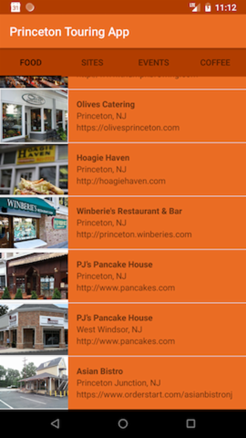

# Princeton Touring App

Suggestions for restaurants, sites to visit, events to attend, and coffee/dessert places to go to, from a local who loves this area.

# About the app

- Built and tested on Nexus 5 API 25
- Item class created to contain object details, e.g. website, image
- Intents added to load list item web site
- An image included for each and event list item

# Example Views
/Users/brenda/code/AndroidStudioProjects/Princeton/app/src/main/res/drawable-xxhdpi/screenshot_20180729_231218.png
/Users/brenda/code/AndroidStudioProjects/Princeton/app/src/main/res/drawable-mdpi/screenshot_20180729_231218.png
/Users/brenda/code/AndroidStudioProjects/Princeton/app/src/main/res/drawable-xhdpi/screenshot_20180729_231218.png
/Users/brenda/code/AndroidStudioProjects/Princeton/app/src/main/res/drawable-xxxhdpi/screenshot_20180729_231218.png
/Users/brenda/code/AndroidStudioProjects/Princeton/app/src/main/res/drawable-hdpi/screenshot_20180729_231218.png

